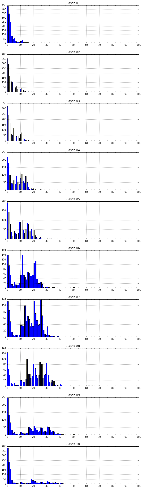

Using the solution set from last time, I looked for spikes on the troop distribution per castle and chose locations that tended to be just past a spike.  I put the leftovers on castle 8.

```python
%matplotlib inline
import pandas as pd
import numpy as np
import matplotlib.pyplot as plt

major_ticks = np.arange(0, 101, 10)                                              
minor_ticks = np.arange(0, 101, 2)                                               

df = pd.read_csv('castle-solutions.csv')
c = ['Castle %s' % str(x).zfill(2) for x in [1,2,3,4,5,6,7,8,9,10]]
h = df.hist(layout=(10,1),column=c,figsize=(10,36),bins=100)
for hi in h:
    hi[0].set_xticks(major_ticks)                                                       
    hi[0].set_xticks(minor_ticks, minor=True)  
```



